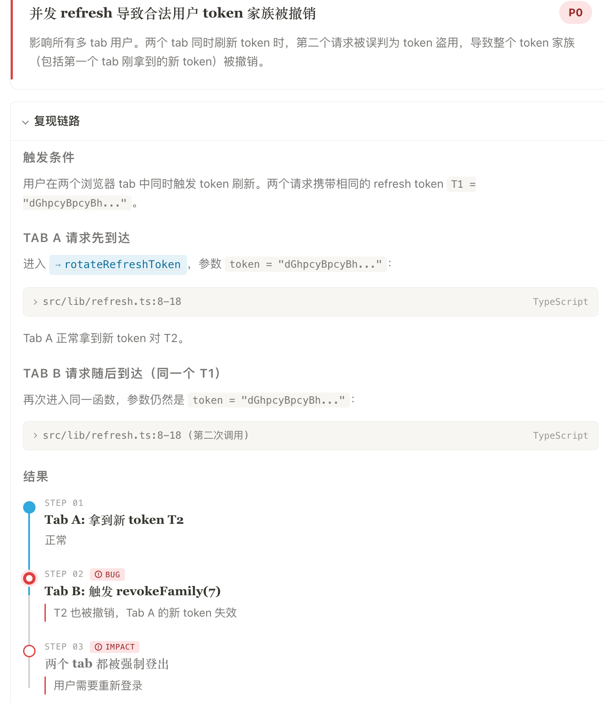
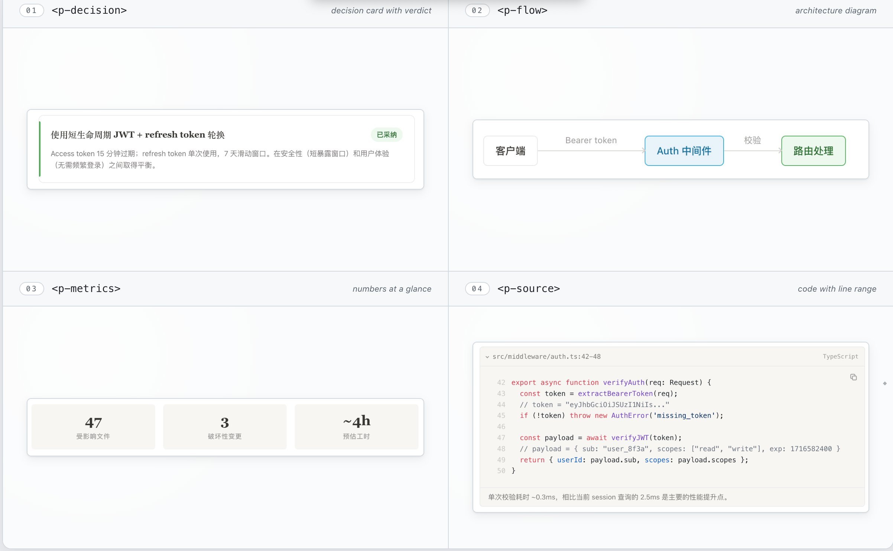

<div align="center">

<picture>
  <source media="(prefers-color-scheme: dark)" srcset=".github/assets/prism-dark.svg">
  
</picture>

# Prism

### A design system for AI-generated documents.

Agents stop reinventing CSS in every artifact — and start writing with **hierarchy, emphasis, and structure** built in.

[](https://github.com/tommy0103/prism/stargazers)
[](https://github.com/tommy0103/prism/releases)
[](LICENSE)
[](dist/prism.iife.js)

</div>

<p align="center">
  
</p>

<p align="center"><em>↑ Same agent. Same prompt. <strong>Without Prism: a wall of markdown.</strong> With Prism: a document a human can scan in seconds.</em></p>

---

## Why Prism

Every time an AI agent produces an HTML artifact, two things go wrong: it **reinvents the visual layer from scratch** (inconsistent, fragile, often ugly), and it **defaults to flat prose** (everything looks the same — decisions, alternatives, references, metrics all dissolve into paragraphs). Prism solves both at once.

### Pillar 01 · The visual layer — stop reinventing CSS

Prism ships **34 production-ready components** with a coherent Notion-inspired theme. Decision cards, callouts, flow diagrams, metrics tiles, source-code blocks with line ranges — all visually consistent, all dark-mode aware, all already debugged.

Agents pick from the DSL. They never write a single `<style>` tag.

### Pillar 02 · The writing layer — teach the agent to organize

Each component encodes a **writing convention**: a verdict belongs in a decision card, not a sentence. A code reference belongs in a `<p-source>`, not a quoted snippet. A comparison belongs in `<p-compare>`, not a "pros and cons" list.

The DSL _is_ the rubric. Agents output documents with real information architecture — readers scan instead of slog.

## Quick start

### Install

```bash
# Install to current project
npx skills add tommy0103/prism

# Or install globally for all projects
npx skills add tommy0103/prism --global
```

No build step needed — the runtime is pre-built. The agent discovers the skill via `SKILL.md` and uses it automatically when you ask for structured documents.

### How it works

**1. Agent writes a template**

```html
<h1>认证系统重构</h1>

<p-decision status="approved" verdict="已采纳">
  <template #title>使用 JWT</template>
  <p>Access token 15 分钟过期,refresh token 单次使用。</p>
</p-decision>

<p-collapse title="详细分析">
  <p>更多内容...</p>
</p-collapse>
```

**2. Build to a single HTML**

```bash
node prism/build.js template.html index.html
```

**3. Open the output**

```bash
open index.html
# No server. No deps. Just HTML.
```

### Preview before installing

```bash
git clone https://github.com/tommy0103/prism.git
cd prism
npx http-server . -p 3000
# Open http://localhost:3000/references/showcase.html
```

## What's in the box

Eight families of primitives, 34 components in total. Each one is a Vue SFC with its own `.md` doc in `src/components/` explaining when (and when not) to use it.

<p align="center">
  
</p>

<details>
<summary><b>Full component list (34)</b></summary>

| Component | What it does |
|-----------|-------------|
| `<p-decision>` | Decision card — approved / rejected / exploring / pending |
| `<p-callout>` | Highlighted block — info / success / warning / danger / purple |
| `<p-collapse>` | Expandable section with smooth animation |
| `<p-collapse-group>` | Accordion — only one collapse open at a time |
| `<p-source>` | Expandable source code block with syntax highlighting |
| `<p-ref>` | Inline reference chip — click to jump to a `<p-source>` |
| `<p-metrics> + <p-metric>` | Key numbers at a glance |
| `<p-bars> + <p-bar>` | Horizontal bar chart |
| `<p-stacked-bar>` | Proportional breakdown with legend |
| `<p-flow> + <p-flow-node> + <p-flow-arrow>` | Architecture flow diagram |
| `<p-steps> + <p-step>` | Timeline — completed / active / danger / warning |
| `<p-compare>` | Pro/con side-by-side comparison |
| `<p-card>` | General-purpose container |
| `<p-code>` | Code block with file path + syntax highlighting |
| `<p-badge> / <p-tag>` | Status badge / monospace label |
| `<p-kv>` | Key-value pair list |
| `<p-divider>` | Section divider, optionally with label |
| `<p-grid>` | Responsive 2/3/4 column layout |
| `<p-file-list>` | File impact map grouped by module |
| `<p-checklist> + <p-check-item>` | Test coverage checklist |
| `<p-tabs> + <p-tab>` | Section-level tab switcher |
| `<p-pages> + <p-page>` | Document-level multi-page (single file) |
| `<p-copy>` | Copy-to-clipboard button |
| `<p-params> + <p-param>` | Interactive parameter panel |

Standard HTML (`<h1>`–`<h4>`, `<p>`, `<hr>`, `<table>`, `<code>`) is auto-styled.

</details>

### Built-in features

- **Line numbers** — code blocks show line numbers. `<p-source path="auth.ts:42-48">` starts at line 42.
- **Copy button** — hover any code block, click to copy (line numbers stripped).
- **Floating TOC** — auto-generated from `<h2>` / `<h3>` with jump navigation.
- **Syntax highlighting** — 14 languages: TS, JS, Rust, C/C++, Python, SQL, JSON, YAML, Bash, HTML, CSS, Diff.
- **Light & dark, auto** — follows `prefers-color-scheme`. Force with `PrismUI.setTheme('dark')`.

## Customization

Prism separates **protocol** (the DSL agents write) from **visual** (what it looks like). You can rebrand without changing how agents use it — the writing conventions stay, the look changes.

| Level | What to do | Rebuild? |
|-------|-----------|----------|
| **CSS variables** | Override `--p-*` in your template's `<style>` | No |
| **New theme** | Write `themes/my-theme.css`, import in `src/index.ts` | Yes |
| **Custom components** | Edit or add Vue SFCs in `src/components/` | Yes |

<details>
<summary><b>Key CSS variables</b></summary>

```css
/* backgrounds */
--p-bg, --p-bg-secondary, --p-surface

/* text colors */
--p-text, --p-text-secondary, --p-text-light

/* semantic colors */
--p-accent, --p-success, --p-warning, --p-danger, --p-purple

/* borders */
--p-border, --p-divider

/* typography */
--p-font-display, --p-font-body, --p-font-mono

/* radii */
--p-radius, --p-radius-lg
```

</details>

## Development

```bash
npm install
npm run build   # Build dist/prism.iife.js
npm run dev     # Watch mode
```

<details>
<summary><b>Project structure</b></summary>

```
prism/
├── SKILL.md                  # Agent entry point
├── references/
│   ├── principles.md         # Design principles + examples
│   ├── showcase.html         # Every component demoed
│   └── example-vue.html      # Minimal example
├── src/
│   ├── components/           # 34 Vue SFCs + .md docs
│   ├── styles/
│   │   ├── base.css          # Structural — don't touch
│   │   └── themes/notion.css # Visual — swappable
│   ├── hljs.ts               # 14-language highlighter
│   ├── index.ts              # Registration + mount
│   └── build-html.ts         # Template → single HTML
├── build.js                  # CLI
├── dist/prism.iife.js        # Built runtime ~103KB gzip
└── README.md
```

</details>

---

## License

MIT © [tommy0103](https://github.com/tommy0103)

<p align="center">
  <sub>◆ &nbsp; PRISM &nbsp; ◆</sub>
</p>