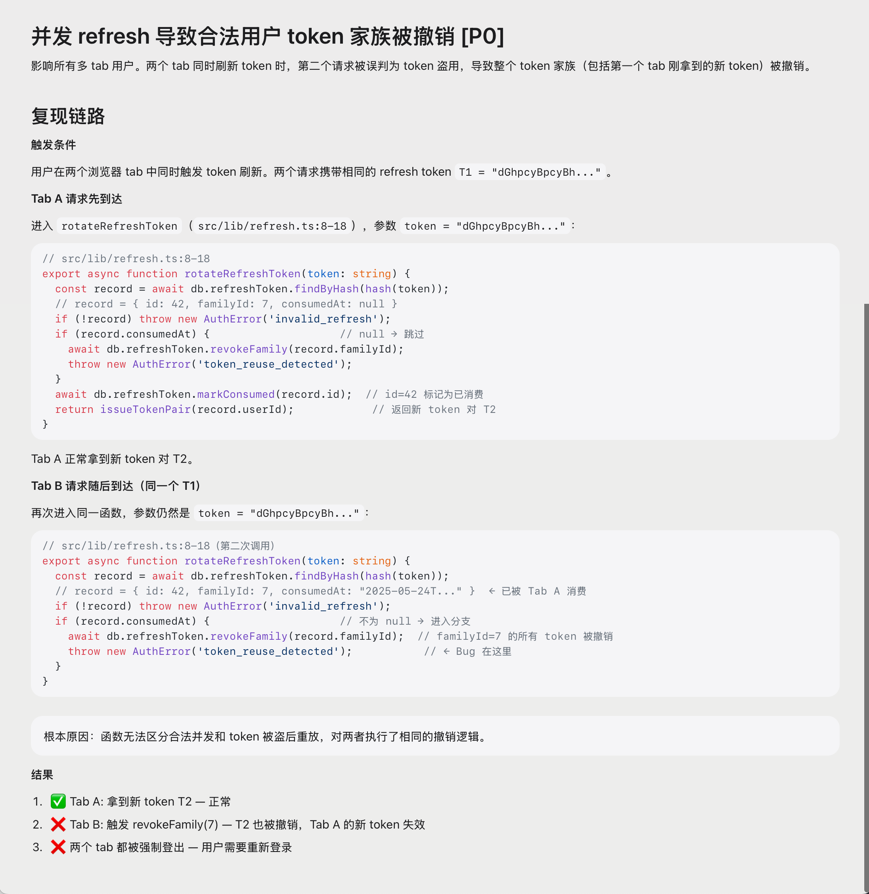

<div align="center">

<picture>
  <source media="(prefers-color-scheme: dark)" srcset=".github/assets/prism-dark.svg">
  
</picture>

# Prism

### A design system for AI-generated documents.

Agents stop reinventing CSS in every artifact — and start writing with **hierarchy, emphasis, and structure** built in.

[](https://github.com/tommy0103/prism/stargazers)
[](https://github.com/tommy0103/prism/releases)
[](LICENSE)
[](dist/prism.iife.js)

</div>

<p align="center">
  
</p>

<p align="center"><i><b>Written by an agent.</b> Every structure above is something markdown cannot do.</i></p>

<p align="center">
  
</p>

<p align="center"><i>Same content, different vocabulary. <b>Down:</b> flat markdown. <b>Up:</b> Prism.</i></p>

<p align="center">
  <a href="https://tommy0103.github.io/prism/references/showcase.html"><b>→ Open the live showcase</b></a>
  &nbsp;·&nbsp;
  <a href="https://github.com/tommy0103/prism/blob/main/references/showcase.html">View source</a>
</p>


---

## Why Prism

### Pillar 01 · The visual layer — stop reinventing CSS

Prism ships **34 production-ready components** with a coherent Notion-inspired theme. Decision cards, callouts, flow diagrams, metrics tiles, source-code blocks with line ranges — all visually consistent, all dark-mode aware, all already debugged.

Agents pick from the DSL. They never write a single `<style>` tag.

### Pillar 02 · The writing layer — teach the agent to organize

Each component encodes a **writing convention**: a verdict belongs in a decision card, not a sentence. A code reference belongs in a `<p-source>`, not a quoted snippet. A comparison belongs in `<p-compare>`, not a "pros and cons" list.

The DSL _is_ the rubric. Agents output documents with real information architecture — readers scan instead of slog.

### Want your own styles? That's fine.

Prism is opinionated, not exclusive. If you want to write your own `<style>`
in a template — for a one-off page, a specific brand moment, or just because —
nothing breaks. Prism components render with semantic class names you can
override, and standard HTML inside a template stays standard HTML. Bring as
much or as little of Prism as you want. **You can see [this](#customization) for more details.**

## Quick start

### Install

```bash
# Install to current project
npx skills add tommy0103/prism

# Or install globally for all projects
npx skills add tommy0103/prism --global
```

No build step needed — the runtime is pre-built. The agent discovers the skill via `SKILL.md` and uses it automatically when you ask for structured documents.

### How it works

**1. Agent writes a template**

```html
<!-- lang: zh-CN -->
<p-decision status="rejected" verdict="P0">
  <template #title>并发 refresh 导致合法用户 token 家族被撤销</template>
  <p>影响所有多 tab 用户。两个 tab 同时刷新 token 时，第二个请求被误判为 token 盗用，导致整个 token 家族（包括第一个 tab 刚拿到的新 token）被撤销。</p>
</p-decision>

<p-collapse title="复现链路">
  <h4>触发条件</h4>
  <p>用户在两个浏览器 tab 中同时触发 token 刷新。两个请求携带相同的 refresh token <code>T1 = "dGhpcyBpcyBh..."</code>。</p>

  <h4>Tab A 请求先到达</h4>
  <p>进入 <p-ref to="bug-rotate-a" label="rotateRefreshToken"></p-ref>，参数 <code>token = "dGhpcyBpcyBh..."</code>：</p>

  <p-source path="src/lib/refresh.ts:8-18" lang="TypeScript" id="bug-rotate-a">
    <pre><code>...</code></pre>
  </p-source>

  <p>Tab A 正常拿到新 token 对 T2。</p>

  <h4>Tab B 请求随后到达（同一个 T1）</h4>
  <p>再次进入同一函数，参数仍然是 <code>token = "dGhpcyBpcyBh..."</code>：</p>

  <p-source path="src/lib/refresh.ts:8-18（第二次调用）" lang="TypeScript" id="bug-rotate-b">
    <pre><code>...</code></pre>
    <template #note>根本原因：<code>rotateRefreshToken</code> 无法区分合法并发和 token 被盗后重放，对两者执行了相同的撤销逻辑。</template>
  </p-source>

  <h4>结果</h4>
  <p-steps>
    <p-step status="completed" title="Tab A: 拿到新 token T2" desc="正常"></p-step>
    <p-step status="danger" title="Tab B: 触发 revokeFamily(7)" desc="T2 也被撤销，Tab A 的新 token 失效"></p-step>
    <p-step status="danger" title="两个 tab 都被强制登出" desc="用户需要重新登录"></p-step>
  </p-steps>
</p-collapse>
```

**2. Build to a single HTML**

```bash
node prism/build.js template.html index.html
```

**3. Open the output**

```bash
open index.html
# No server. No deps. Just HTML.
```

### Preview before installing

```bash
git clone https://github.com/tommy0103/prism.git
cd prism
npx http-server . -p 3000
# Open http://localhost:3000/references/showcase.html
```

## What's in the box

**34 components, 8 families.** Each one ships with a .md doc in src/components/ explaining when (and when not) to use it.

<p align="center">
  
</p>

| Family | Components |
|--------|-----------|
| **Decisions** | `<p-decision>` · `<p-callout>` |
| **Structure** | `<p-collapse>` · `<p-collapse-group>` · `<p-tabs>` · `<p-pages>` · `<p-divider>` · `<p-grid>` |
| **Source code** | `<p-source>` · `<p-ref>` · `<p-code>` · `<p-copy>` |
| **Data** | `<p-metrics>` · `<p-bars>` · `<p-stacked-bar>` |
| **Process** | `<p-flow>` · `<p-steps>` · `<p-compare>` |
| **Container** | `<p-card>` · `<p-file-list>` · `<p-checklist>` |
| **Inline** | `<p-badge>` · `<p-tag>` · `<p-kv>` |
| **Interactive** | `<p-params>` |

<details>
<summary><b>Full component list</b></summary>

| Component | What it does |
|-----------|-------------|
| `<p-decision>` | Decision card — approved / rejected / exploring / pending |
| `<p-callout>` | Highlighted block — info / success / warning / danger / purple |
| `<p-collapse>` | Expandable section with smooth animation |
| `<p-collapse-group>` | Accordion — only one collapse open at a time |
| `<p-source>` | Expandable source code block with syntax highlighting |
| `<p-ref>` | Inline reference chip — click to jump to a `<p-source>` |
| `<p-metrics> + <p-metric>` | Key numbers at a glance |
| `<p-bars> + <p-bar>` | Horizontal bar chart |
| `<p-stacked-bar>` | Proportional breakdown with legend |
| `<p-flow> + <p-flow-node> + <p-flow-arrow>` | Architecture flow diagram |
| `<p-steps>` + `<p-step>` | Timeline with progress (done/active/todo) + flags (warning/danger/success/info) |
| `<p-compare>` | Pro/con side-by-side comparison |
| `<p-card>` | General-purpose container |
| `<p-code>` | Code block with file path + syntax highlighting |
| `<p-badge> / <p-tag>` | Status badge / monospace label |
| `<p-kv>` | Key-value pair list |
| `<p-divider>` | Section divider, optionally with label |
| `<p-grid>` | Responsive 2/3/4 column layout |
| `<p-file-list>` | File impact map grouped by module |
| `<p-checklist> + <p-check-item>` | Test coverage checklist |
| `<p-tabs> + <p-tab>` | Section-level tab switcher |
| `<p-pages> + <p-page>` | Document-level multi-page (single file) |
| `<p-copy>` | Copy-to-clipboard button |
| `<p-params> + <p-param>` | Interactive parameter panel |

Standard HTML (`<h1>`–`<h4>`, `<p>`, `<hr>`, `<table>`, `<code>`) is auto-styled.

</details>

### Built-in features

- **Line numbers** — code blocks show line numbers. `<p-source path="auth.ts:42-48">` starts at line 42.
- **Copy button** — hover any code block, click to copy (line numbers stripped).
- **Floating TOC** — auto-generated from `<h2>` / `<h3>` with jump navigation.
- **Syntax highlighting** — 14 languages: TS, JS, Rust, C/C++, Python, SQL, JSON, YAML, Bash, HTML, CSS, Diff.
- **Light & dark, auto** — follows `prefers-color-scheme`. Force with `PrismUI.setTheme('dark')`.

## Future directions

Prism is intentionally small today — 34 components, one Notion-inspired theme,
one build path. The plan is to grow the **vocabulary**, not the surface area.

- **More themes** — Linear-style, brutalist, editorial, terminal-dark. The
  protocol stays the same; only the visual layer swaps. Themes will live in
  `themes/` as drop-in CSS files.
- **More writing primitives** — `<p-glossary>`, `<p-changelog>`, `<p-spec>`,
  `<p-test-result>`. Driven by real agent patterns we see in the wild.
- **Theme authoring kit** — a documented token set + a contrast checker, so
  community themes ship with the same quality bar as the Notion default.
- **Agent feedback loop** — capture which components agents reach for most,
  surface gaps where they fall back to raw HTML.

Have a theme or component you want to see? [Open an issue][issues] — Prism's
direction is shaped by the documents agents are actually writing.

[issues]: https://github.com/tommy0103/prism/issues

## Customization

Prism separates **protocol** (the DSL agents write) from **visual** (what it looks like). You can rebrand without changing how agents use it — the writing conventions stay, the look changes.

| Level | What to do | Rebuild? |
|-------|-----------|----------|
| **CSS variables** | Override `--p-*` in your template's `<style>` | No |
| **New theme** | Write `themes/my-theme.css`, import in `src/index.ts` | Yes |
| **Custom components** | Edit or add Vue SFCs in `src/components/` | Yes |

<details>
<summary><b>Key CSS variables</b></summary>

```css
/* backgrounds */
--p-bg, --p-bg-secondary, --p-surface

/* text colors */
--p-text, --p-text-secondary, --p-text-light

/* semantic colors */
--p-accent, --p-success, --p-warning, --p-danger, --p-purple

/* borders */
--p-border, --p-divider

/* typography */
--p-font-display, --p-font-body, --p-font-mono

/* radii */
--p-radius, --p-radius-lg
```

</details>

## Development

```bash
npm install
npm run build   # Build dist/prism.iife.js
npm run dev     # Watch mode
```

<details>
<summary><b>Project structure</b></summary>

```
prism/
├── SKILL.md                  # Agent entry point
├── references/
│   ├── principles.md         # Design principles + examples
│   ├── showcase.html         # Every component demoed
│   └── example-vue.html      # Minimal example
├── src/
│   ├── components/           # 34 Vue SFCs + .md docs
│   ├── styles/
│   │   ├── base.css          # Structural — don't touch
│   │   └── themes/notion.css # Visual — swappable
│   ├── hljs.ts               # 14-language highlighter
│   ├── index.ts              # Registration + mount
│   └── build-html.ts         # Template → single HTML
├── build.js                  # CLI
├── dist/prism.iife.js        # Built runtime ~103KB gzip
└── README.md
```

</details>

---

## License

MIT © [tommy0103](https://github.com/tommy0103)

<p align="center">
  <sub>◆ &nbsp; PRISM &nbsp; ◆</sub>
</p>